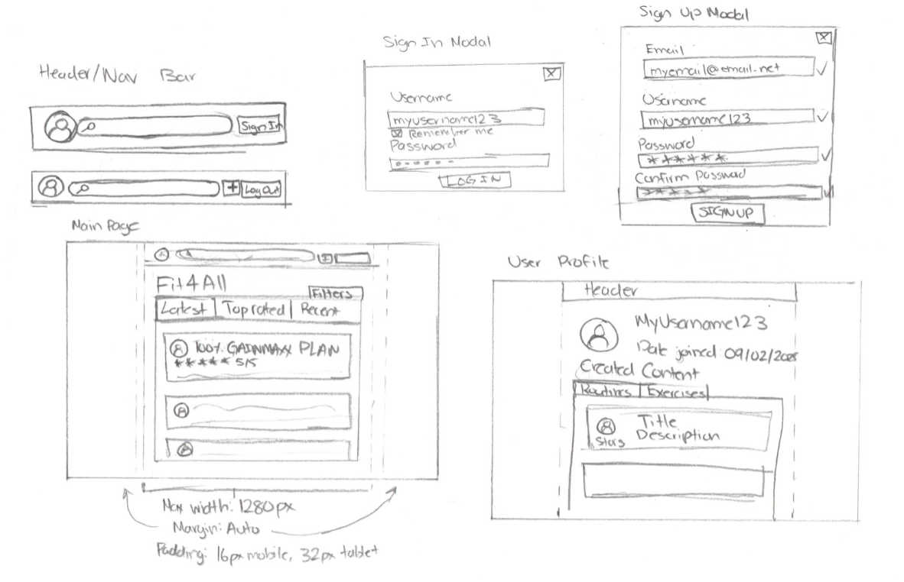
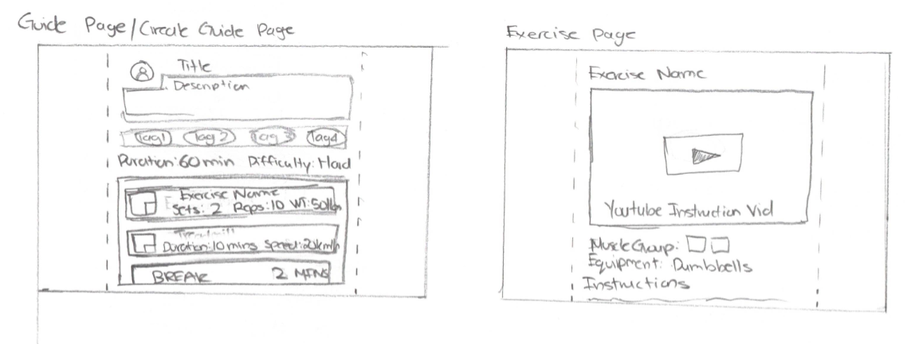

# Project Title
Fit4All 

## Overview

Fit4All is web app for fitness enthusiasts, or for anyone looking to find a new routine/plan/guide to try out!

### Problem Space

Fit4All is mainly created for the intention of being able to easily find, search, or create routines/plans/guides without having to sift through countless blog posts or outdated websites. The goal is to showcase good guides that have been created by users, for users. Another goal is being able to take someone elses guide, and to be able to easily customize it to better suit their own needs. Everyone has a different body, after all!

### User Profile

The primary user base that this app is marketed towards are fitness enthusiasts, gym goers, or just anyone that wants to easily find a new workout routine/guide. Another user base are fitness content creators that want to easily share their guides to their viewerbase. 

### Features

List the functionality that your app will include. These can be written as user stories or descriptions with related details. Do not describe _how_ these features are implemented, only _what_ needs to be implemented.

- As a user, I want to be able to see the latest and trending guides on the main website page.
- As a user, I want to be able to see the most upvoted/viewed guides on the main website page.
- As a user, I want to be able to see new and recent guides on the main website page.
- As a user, I want to be able to see an accounts' user profile and guides. 

- As a logged in user, I want to be able to create my own guides/routines/exercises.
- As a logged in user, I want to be able to edit another user's guide to suit my own style.
- As a logged in user, I want to rate another user's guide/exercise.
- As a logged in user, I want to be upate/delete guides that I have already posted.
- As a logged in user, I want to have private guides that only I can view.
- As a logged in user, I want to be able to favorite/bookmark a guides/routine/exercise. 
- As a logged in user, I want to have publicly posted guides that anyone can view.
- As a logged in user, I want to be able to leave comments on guides/routines/exercises.
- As a logged in user, I want to be able to rate users' comments.

## Implementation

### Tech Stack

#### Front-End

This will be updated as more libraries/technologies are added. 

- Vite React
- Python
- Django
- Express (Backup)
- Knex (Backup)
- MySQL/SQLite3
- Client libraries: 
    - react
    - react-router
    - react-modal
    - react-select
    - Axios
    - dotenv
    - sass
- Server libraries:
    - Django
    - Django REST framework
    - UUID

### APIs

None.

### Sitemap

- Home/Main page
- Sign In/Sign Up Page
- User Profile Page
- Guide/Routine/Exercise Page
- Create Guid/Routine/Exercise Page
- Search Page

### Mockups

#### Page 1 Mockups

#### Page 2 Mockups

### Data

### Endpoints

Will fill out endpoints later. 

## Roadmap

Scope your project as a sprint. Break down the tasks that will need to be completed and map out timeframes for implementation working back from the capstone due date. 
- Create client
    - react vite project with skeleton routes and pages

- Create back-end server
    - Determine if using Django is feasible and implmentable, if not, switch to using Node Express and Knex.

- Create database models and schema
- Create migrations
- Create sample seed data 

- Feature: Create user account
- Feature: Login
- Feature: Home Page
- Feature: Exercises
    - View exercises
    - (nice to have) Create custom exercises
- Feature: Guide Page
    - View Guides
    - Create/Update/Delete Guides
- Feature: User Profile
- Feature: Rate guides
- Feature: Commenting on guides
- Feature: Sort Guides on Homepage by most recent, most highly rated, and latest/trending. 
- Feature: Bookmarked/Saved guides
- Feature: Customize other user guides to your users' liking
- Implement nice-to-haves if possible
- Bug fixes

- DEMO 

---

## Future Implementations

- Deploy back-end server on Herkou and client on front-end
- Allow users to create thier own custom exercises
- Expand commenting by allowing users to reply to other comments and not only the guide itself
- Allow users to subscribe/follow other users
- Gives badges/verification to users that post highly rated guides\

## References

### https://www.youtube.com/watch?v=dL5SOdgMbRY
Used for drag and drop list

